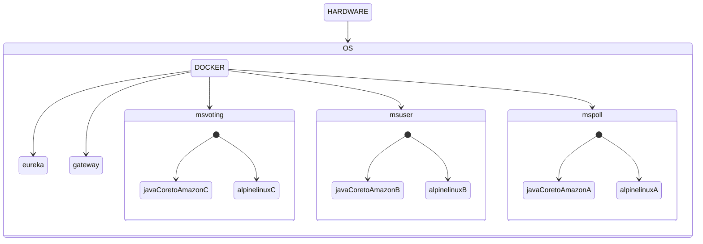

# Challenge 3 - Compass

## TOOLS USED

1. Spring Cloud Gateway
2. Eureka Server
3. RabbitMQ
4. Docker
5. OpenFeign

---

## HTTP REQUESTS

> Use the links below to go to the URLs

| Microservice    | Name               | Http method | Link                                          | Body / Query                                                   |
| --------------- | ------------------ | ----------- | --------------------------------------------- | -------------------------------------------------------------- |
| user-controller | postNewUser        | POST        | [Go](http://localhost:8080/users)             | { "cpf": "valid cpf", "name": "your name"} as json body        |
| user-controller | getUsers           | GET         | [Go](http://localhost:8080/users/{id})        | userId (String cpf) as path variable                           |
| poll-controller | getPollVoted       | GET         | [Go](localhost:8080/polls/voted)              | -                                                              |
| poll-controller | deletPollById      | DELETE      | [Go](localhost:8080/polls/{pollId})           | pollId (integer) as path variable                              |
| poll-controller | updatePollAsActive | PUT         | [Go](localhost:8080/polls/{pollId})           | pollId (integer) as path variable}                             |
| poll-controller | postNewPoll        | POST        | [Go](localhost:8080/polls)                    | { "name": "improvement namme", "minutesActive": } as Json body |
| poll-controller | getPollById        | GET         | [Go](localhost:8080/polls/{id})               | pollId (integer) as path variable}                             |
| poll-controller | getAllPolls        | GET         | [Go](localhost:8080/polls/all)                | -                                                              |
| vote-controller | getVoteByPoll      | GET         | [Go](localhost:8080/votes/listByPoll?pollId=) | {"pollId" : "pollId"} as query params}                         |
| vote-controller | postNewVote        | POST        | [Go](localhost:8080/votes?cpf=&pollId=)       | { "cpf": "cpf", "pollId": "pollId"} as query params            |

---

## MICROSERVICES

### Api-gateway

- Establishes routes to each microservices

### MS-Eureka-Server

- Registers microservices to be found and used by other microservices

### MS-Poll

- Registers a new poll of improvements into the database
- Sets a registered poll as active to receive votes
- Sets a registered and active poll as voted when it finishes
- Returns all polls registered
- Returns all registered polls voted
- Deletes a poll

### MS-User

- Registers a new user into the database
- Checks if user information (CPF) is valid
- Returns a registered user

### MS-Voting

- Registers new votes into the database
- Uses OpenFeign to request data to Ms-user and Ms-poll

---

## Usage of dockerfiles and docker-compose.yaml

### What is docker

> Docker is an open platform for developing, shipping, and running applications. Docker enables you to separate your applications from your infrastructure, so you can deliver software quickly. [Source](https://docs.docker.com/get-started/overview/)

### Commands to use after cloning the repository into your machine

- Log into RabbitMQ using 'guest' as username and password
- Then create to regular queues as 'result-publisher-string' and 'result-publisher'
  - Ms-voting uses both as publisher
  - Ms-user uses 'result-publisher-string' as consumer to show what are the results for each poll
  - Ms-poll uses 'result-publisher' as consumer to update poll's result value
- Finally use docker commands

`docker compose build`

- To download and update the containers

`docker compose up`

- To run the containers

### Dockerfile

> Each project has its own Dockerfile containing instructions to build the images

### docker-compose.yml

> This file sets how each container should act while running with docker
>
> While in development, we decided to use a specific designed by user netowrk to manage communication between the containers, setting fixed IPs to each microservice

### Containers

#### Individual Microservice container

---
